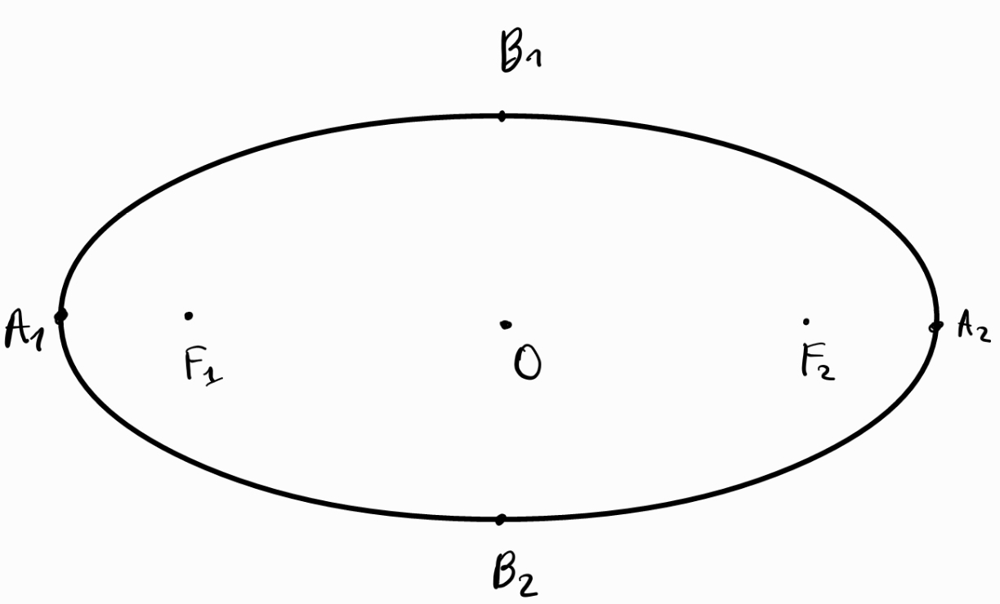

1. Елипса - геометрично място от точки, за които сборът от разстоянията от всяка такава точка до две предварително избрани точки $F_1, F_2$ е константа
	
	
	
	$$E \in \varepsilon \implies |EF_1| + |EF_2| = 2|OA_1| = 2|OA_2|$$
	
	**а) фокуси на елипсата** - точките $F_1, F_2$
	
	**б) център на елипсата** - средата $O$ на отсечката $F_1F_2$
	
	**в) ос на елипсата** - всяка отсечка, която свързва две точки от елипсата
	- голяма ос ($A_1 A_2$) - най-дългата ос в елипсата, която свързва двете най-отдалечени една от друга точки ($A_1$ и $A_2$)
	- малка ос ($B_1B_2$) - най-късата ос в елипсата, която вързва двете най-близки една до друга точки ($B_1$ и $B_2$)
	
	*Центърът и двата фокуса на елипсата винаги лежат на нейната голяма ос.*
	
	*Голямата и малката оси на елипсата са взаимноперпендикулярни и се разполовяват в нейния център.*

2. Канонично уравнение на елипса с център началото на кординатната система
	
	
	
	$$\varepsilon: \frac{x^2}{a^2}+\frac{y^2}{b^2} = 1$$
	
	**а) координати на фокусите:**  $(\pm\sqrt{a^2+b^2}; 0)$
	
	**б) взаимно положение с права** $p: \alpha x +\beta y + \gamma = 0$
	- нямат пресечни точки: $a^2\alpha^2 +b^2\beta^2 -\gamma^2 \lt 0$
	- допират се в една точка: $a^2\alpha^2 +b^2\beta^2 -\gamma^2 = 0$
	- пресичат се в две точки: $a^2\alpha^2 +b^2\beta^2 -\gamma^2 \gt 0$
	
	**в) допирателна към елипса** 
	- през точка $P(x_P, y_P) \in \varepsilon$
	
	$$p: \frac{x_P}{a^2}x + \frac{y_P}{b^2}y = 1$$