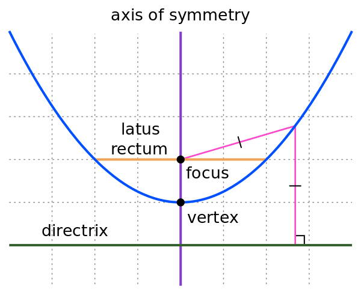

1. Парабола - геометрично място от точки, за които разстоянието до предварително определена точка $F$ е равно на разстоянието до предварително определена права $d$
	
	
	
	**а) фокус на параболата** - точката $F$
	
	**б) директриса на параболата** - правата $d$
	- директрисата винаги е успоредна на допирателната през върха на чараболата
	
	**в) връх на параболата** - точката $V$
	- най-близката до директрисата и фокуса точка
	
	**г) ос на симетрия** - правата $VF$

2. Уравнение на парабола с фокус $F(x_F, y_F)$ и директриса $d: ax + by + c = 0$
	
	$$\frac{(ax + by + c)^2}{a^2+b^2} = (x-x_F)^2 + (y-y_F)^2$$
	
	

3. Канонично уравнение на парабола - 
	
	$$y^2 = 2px$$
	
	**а) фокус на параболата:** $F\left(\frac{p}{2};0\right)$
	
	**б) директриса на параболата:** $d: x=-\frac{p}{2}$
	
	**в) взаимно положение с правата** $t: \alpha x +\beta y + \gamma = 0$
	- нямат пресечни точки: $p\beta^2-2\alpha\gamma \lt 0$
	- допират се в единствена точка: $p\beta^2-2\alpha\gamma =0$
	- пресичат се в две точки: $p\beta^2-2\alpha\gamma \gt 0$
	
	**г) допирателна към параболата**
	- през точка $T(x_T; y_T)$
	
	$$t: y_Ty = p(x + x_T)$$