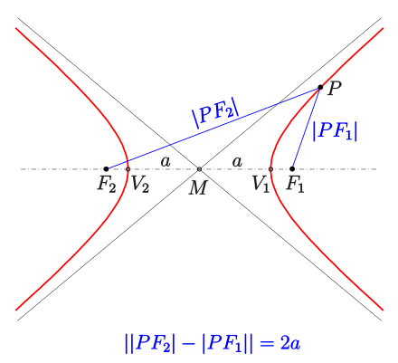

1. Хипербола - геометрично място от точки в равнината, за които абсолютната стойност на разликата от разстоянията до две предварително определени точки е постоянна
	
	$$|PF_1 - PF_2| = \text{const} = 2a$$
	
	
	
	**а) фокуси на хиперболата** - точките $F_1$ и $F_2$
	
	**б) център на хиперболата** - точката $O$, която е среда на $F_1F_2$
	
	**в) върхове на хиперболата** - точките $V_1$ и $V_2$

2. Канонично уравнение на хипербола с център началото на кординатната система
	
	$$\chi: \frac{x^2}{a^2} - \frac{y^2}{b^2} = 1$$
	
	**а) координати на фокусите:** $(\pm \sqrt{a^2 + b^2}; 0)$
	
	**б) координати на върховете:** $(\pm a; 0)$
	
	**в) взаимно положение на хипербола и права** $p: \alpha x + \beta y + \gamma = 0$
	- пресичат се в две точки: $a^2\alpha^2 -b^2\beta^2 -\gamma^2 \gt 0$
	- допират се в една точка: $a^2\alpha^2 -b^2\beta^2 -\gamma^2 = 0$
	- няма пресечни точки: $a^2\alpha^2 -b^2\beta^2 -\gamma^2 \lt 0$
	
	**г) допирателна към хиперболата**
	- през точка $P(x_P, y_P) \in \chi$
	
	$$\frac{x_P}{a^2}x - \frac{y_P}{b^2}y = 1$$
	- през точка $P(x_P, y_P) \notin \chi$