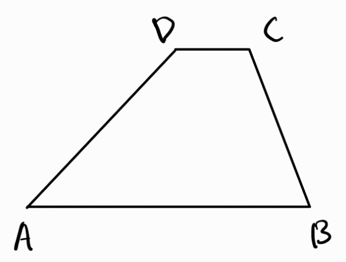

1. Трапец - четириъгълник, на който поне една двойка срещуположни страни са успоредни
	
	
	
	**а) средна основа** - успоредна на основите на трапеца
	
	
	
	$$MN = \frac{AB + CD}{2}$$
	
	$$PQ = \frac{AB - CD}{2}$$
	
	**б) лице**
	
	$$S = \frac{(AB+CD)\cdot h}{2}$$

2. Равнобедрен трапец - трапец с равни бедра
	
	
	
	**а) ъгли**
	- равни ъгли при основите
	
	*Трапец е равнобедрен тогава и само тогава, когато има равни ъгли при основите.*
	
	**б) диагонали**
	- равни помежду си
	- сключват равни ъгли с основите на трапеца
	
	*Трапец е равнобедрен тогава и само тогава, когато има равни диагонали.*
	
	*Трапец е равнобедрен тогава и само тогава, когато диагоналите му сключват равни ъгли с основите.*
	
	**в) вписаност** - трапец е вписан в окръжност тогава и само тогава, когато е равнобедрен