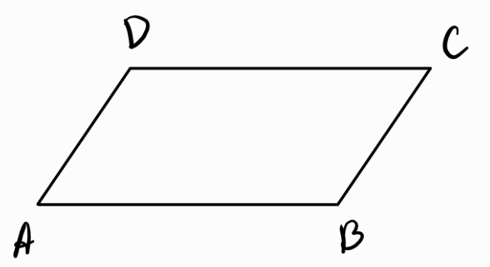

1. Успоредник - четириъгълник, на който две по две срещуположните страни са успоредни и равни помежду си
	
	
	
	**а) периметър**
	
	$$P = 2(AB + BC)$$
	
	**б) лице**
	
	$$S = AB\cdot h_{AB} = BC \cdot h_{BC}$$
	$$S = AB\cdot AD \sin \measuredangle DAB = AB \cdot BC \measuredangle ABC$$
	
	**в) диагонали**
	- взаимно се разполовяват
	
	
	
	*Всеки четириъгълник с взаимноразполовяващи се диагонали е успоредник.*
	
	- следствие от теоремата на Ойлер: $$\color{orange}AC^2 \color{black}+ \color{Cerulean}BD^2 \color{black}= 2(AB^2 + BC^2)$$

2. Вписан успоредник - около успоредник може да се опише окръжност тогава и само тогава, когато е правоъгълник
3. Описан успоредник - в успоредник може да се впише окръжност тогава и само тогава, когато е ромб
4. Ромб - успоредник с четири равни страни
	
	
	
	*Всеки четириъгълник с четири равни страни е ромб.*
	
	**а) диагонали**
	- ъглополовящи на ъглите на ромба
	- взаимноперпендикулярни
	
	*Всеки успоредник с взаимноперпендикулярни диагонали е ромб.*
	
	**б) лице**
	
	$$S = \frac{AC\cdot BD}{2}$$
	
	**в) описаност** - във всеки ромб може да се впише окръжност