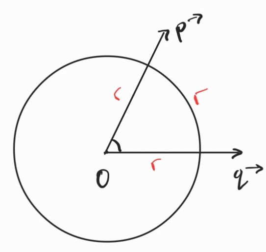

1. Радиан - мярката на централния ъгъл $\angle (Op^{\rightarrow}; Oq^{\rightarrow})$, на който съответства дъга с дължина, равна на радиуса $r$ на окръжността
	
	
	$$2\pi \text{ rad} = 360\degree$$

2. Обобщен ъгъл - ъгъл с мярка $\alpha \pm k\cdot 360\degree (\alpha \pm 2k\cdot \pi \text{ rad}), k \in \mathbb{N}_0$, където $\alpha$ е мярката на ъгъла между абсцисната ос и другото рамо, а $k$ представлява брой пълни завъртания около центъра на координатната система
	
	