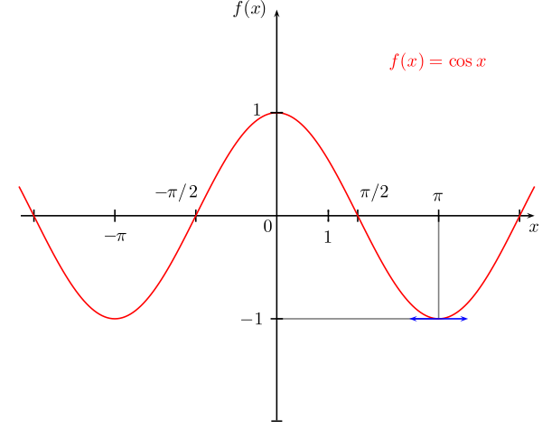
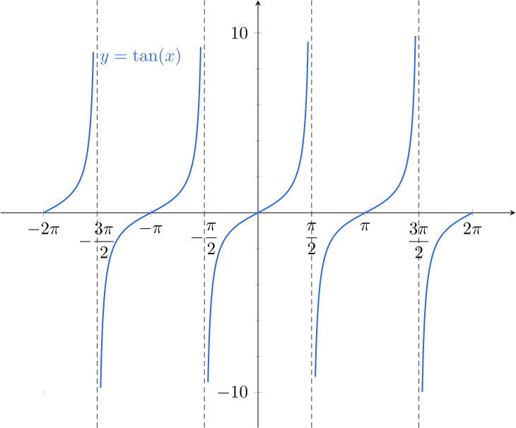
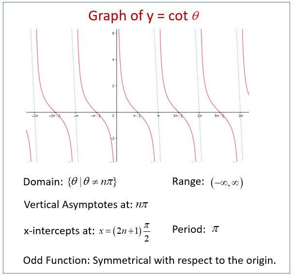

1. Синус на обобщен ъгъл - функцията $\sin \theta$ на обобщения ъгъл $\theta$ е ординатата на пресечната точка на второто рамо на ъгъла с единичната окръжност

	$$\sin \theta \in [-1; 1]$$
	
	
	
	**а) свойства**
	- период: $T = 2\pi$
	
	$$\sin \theta = \sin (\theta \pm 2k\cdot\pi), k \in \mathbb{Z}$$
	
	- нечетност
	
	$$\sin(-\theta) = -\sin \theta$$

2. Косинус на обобщен ъгъл - функцията $\cos \theta$ на обобщения ъгъл $\theta$ е абсцисата на пресечната точка на второто рамо на ъгъла с единичната окръжност
	
	$$\cos \theta \in [-1;1]$$
	
	
	
	**а) свойства**
	- период: $T = 2\pi$
	
	$$\cos \theta = \cos (\theta \pm 2k\cdot\pi), k \in \mathbb{Z}$$
	
	- четност
	$$\cos (-\theta) = \cos \theta$$

3. Тангенс на обобщен ъгъл - функцията $\tan \theta$ на обобщения ъгъл $\theta \ne (2k+1)\frac{\pi}{2}, k \in \mathbb{Z}$ е ординатата на пресечната точка на второто рамо на ъгъла с единичната окръжност
	
	$$\tan \theta \in (-\infty;+\infty)$$
	
	
	
	**а) свойства**
	- период: $T = \pi$
	
	$$\tan \theta = \tan (\theta \pm k\cdot\pi), k \in \mathbb{Z}$$
	
	- нечетност
	
	$$\tan(-\theta) = -\tan \theta$$

4. Котангенс на обобщен ъгъл - функцията $\cot \theta$ на обобщения ъгъл $\theta \ne k\pi, k \in \mathbb{Z}$ е абсцисата на пресечната точка на второто рамо на ъгъла с единичната окръжност
	
	$$\cot \theta \in (-\infty;+\infty)$$
	
	
	
	**а) свойства**
	- период: $T = \pi$
	
	$$\cot \theta = \cot (\theta \pm k\cdot\pi), k \in \mathbb{Z}$$
	
	- нечетност
	
	$$cot(-\theta) = -\cot \theta$$
