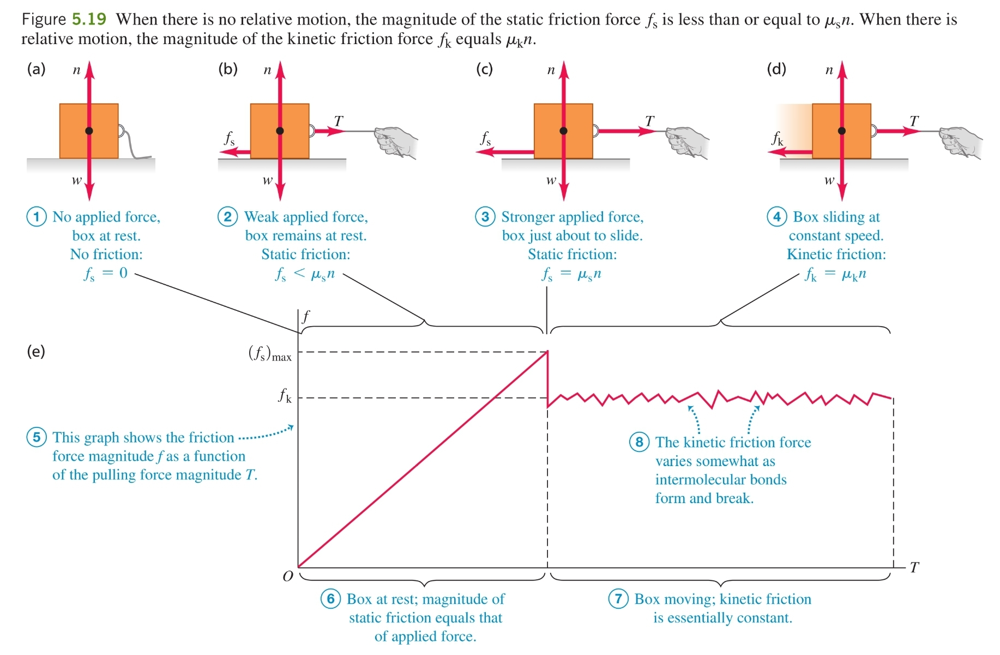

1. Механизъм - когато две повърхности се докосват, химични връзки започват да се формирст и разпад между тях, създавайки сили. Когато се приложи външна сила, ефектът на тези сили между повърхностите е обща сила, наречена сила на триене, която се опитва да се противопостави на външната сила
	
	

2. Сила на триене при покой ($\vec{f}_s$) - преди едно тяло да започне да се плъзга по дадена повърхност, върху него трябва да се приложи сила $\vec{F}$ с определен магнитуд. Това е така, защото при прилагането на силата $\vec{F}$ възниква сила на триене при покой $\vec{f}_s$, която напълно й противодейства
	
	$$f_s = F, F \le (f_s)_{\text{max}}$$
	
	**а) максимална сила на триене** $(f_s)_{\text{max}}$ - силата на триене при покой има лимит и когато приложената сила $F$ го надвиши, тялото започва да се движи
	
	$$(f_s)_{\text{max}} = \mu_s N$$
	
	- коефициент на триене при покой: $\mu_s \in (0;1)$
	- сила на реакция на опората: $N$
	- когато се надвиши максималната сила на триене при покой, тя спира да действа и започва да действа само силата на триене при движение

3. Сила на триене при движение ($\vec{f}_k$) - силата на триене, когато се надмине максималната сила на триене при покой и тялото започне да се движи
	
	**а) магнитуд** - правопропорционален на големината на силата на реакция на опората
	
	$$f_k = \mu_k N$$
	
	- коефициент на триене при движение: $\mu_k \in (0;1)$
	- сила на реакция на опората: $N$
	
	**б) посока** - винаги перпендикулярна на силата на реакция на опората и обратна на посоката на движение

4. Сила на триене ($\vec{f}$) - или силата на триене при покой, или силата на триене при движение (в зависимост от това дали вече е надмината максималната сила на триене при покой)