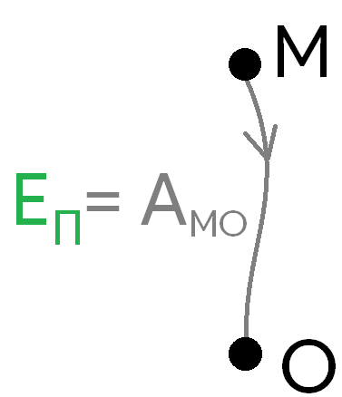
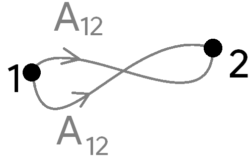
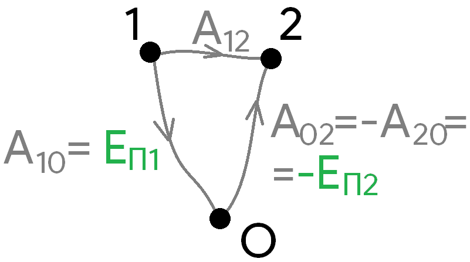

1. Работа ($A, [\text{J}]$)
	
	**а) на постоянна сила**
	
	$$A \overset{\text{def}}{=} \vec{F}\cdot \Delta \vec{r}$$
	
	**б) на променлива сила**
	
	$$A = \int \vec{F}\, d\vec{r}$$
	
	Доказателство:
	
	За безкрайно малко преместване $d\vec{r}$ силата е приблизително постоянна и работата за това преместване е $dA = \vec{F}\cdot d\vec{r}$.

2. Кинетична енергия
	
	$$K \overset{\text{def}}{=} \frac{1}{2}m\vec{v}^2 = \frac{1}{2}mv^2$$
	
	**а) връзка с работа** - промяната в кинетичната енергия е равна на работата на действащата сила
	
	$$\Delta K = K_2 - K_1 = A$$
	
	Доказателство: 
	
	$$dK = d\left(\frac{1}{2}m\vec{v}^2\right) = \frac{m}{2} 2\vec{v} \cdot d\vec{v} = m\vec{v} \cdot \frac{d\vec{v}}{dt}dt = m\vec{a}\cdot\vec{v} \,dt = \vec{F}\cdot d\vec{r}$$
	
	**б) принцип на суперпозицията** - работата на равнодействащата сила е равна на сбора на работите (като скалари) на всяка сила поотделно
	
	Доказателство:
	
	$$\vec{F}_{\text{net}} = \sum \vec{F}_i$$
	
	$$dA_i = \vec{F}_i \cdot d\vec{r}$$
	$$dA = \sum dA_i = \sum \vec{F}_i \cdot d\vec{r} = \vec{F}_{\text{net}}\cdot d\vec{r}$$

3. Потенциална енергия - работата, която дадена консервативна сила би извършила при преместването на тяло от дадена точка до нулевото равнище
	
	**а) нулево равнище** - точката в пространството, която приемаме, че има нулева потенциална енергия
	
	**б) консервативна сила** - сила, за която може да се дефинира потенциална енергия
	- работата на силата зависи само от разликата в местоположението, но не и от конкретната траектория на тялото
	

	**в) гравитационна потенциална енергия** - работата, която гравитацията би извършила върху тяло, което пада от височина $y$
	
	$$U_g = mgy$$
	
	
	- гравитационната потенциална енергия на система от тела (или на тяло, което не е материална точка) е същата все едно всичката маса на системата е съсредоточена в центъра на масите ѝ
	
	**г) еластична потенциална енергия**
	
	$$U_{el} = \frac{1}{2}kx^2$$
	
	
	
	Доказателство: 
	
	По закона на Хук силата, с която действа пружината е $F_{el} = -kx$. За безкрайно малко преместване $dx$ тя извършва $dA = - kx\,dx$.
	
	Тогава цялата работа, която силата ще извърши, премествайки пружината от позиция $x$ до равновесното положение е
	
	$$\int_x^0 -kx \,dx = -kx^2\Big| _x^0 = \frac{1}{2}kx^2$$

5. Закон за запазване на енергията - сумата от кинетичната и потенциалната енергия и работата на неконсервативните сили в даден момент е равна на сумата на кинетичната и потенциалната енергия в следващия момент
	
	$$K_1 + U_1 + A = K_2 + U_2$$
	
	Доказателство:
	
	Работата на консервативните сили е равна на промяната на потенциалната енергия, със знак минус.
	
	
	
	$$A_{12} = A_{10} + A_{02} = A_{10} - A_{20} = U_1 - U_2$$
	
	Използваме, че промяната на кинетичната енергия е равна на работата на всички сили, като отделяме от едната страна началната енергия, а от другата страна - крайната енергия

	$$K_{2} - K_1 = A_{конс} + A_{неконс} = U_1 - U_2 + A_{неконс}$$