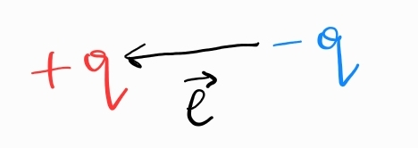

1. Електричен дипол - система от два противоположни заряда, които се намират на много късто разстояние един от друг
	
	
	
	**а) диполен момент** ($\vec{\mu}$) - вектор, сочещ от отрицателния към положиетлния заряд
	
	$$\vec{\mu} = q\vec{l}$$
	
	**б) дипол в електрично поле** - върху двата краища на дипола действат сили, които създават въртящ момент, който се стреми да ориентира дипола по посока на електричното поле
	
	$$\vec{\tau} = \vec{\mu}\times \vec{E}$$
	
	
	

2. Диелектрик - вещество с много малък брой свободни заряди

3. Поляризация на диелектриците - молекулите в диелектрик, поставен във външно поле $\vec E_0$, се завъртат така, че създават собствено електрично поле $\vec  E_1$, в посока, противоположна на $\vec E_0$. Общото електрично поле $\vec E = \vec E_0 + \vec E_1$ се оказва пропорционално на $\vec E_0$.
	
	
	
	**а) относителна диелектрична проницаемост** ($\varepsilon_r, []$) - отношението между магнитуда на първоначалното електрично поле $\vec{E}_0$ към отношението на магнитуда на последвалото общо електричното поле
	
	$$\varepsilon_r \overset{\text{def}}{=} \frac{|\vec{E}_0|}{|\vec{E}|}$$
	
	- заряд $q$ в диелектрик в електрично поле - 
	
	**б) диелектрична проницаемост на средата** 
	
	$$\varepsilon \overset{\text{def}}{=} \varepsilon_r \varepsilon_0$$

4. Заряд $q$ в диелектрична среда - заедно с диелектричната среда с проницаемост $\varepsilon$ ще създадат поле, което е по-слабо от това, което щеше да създаде зарядът във вакуум
	
	
	
	$$\vec{E} = \frac{\vec E_0}{\varepsilon_r} = \frac{q}{4\pi\varepsilon_0 \varepsilon_rr^2}\hat{r} = \frac{q}{4\pi\varepsilon r^2}\hat{r}$$