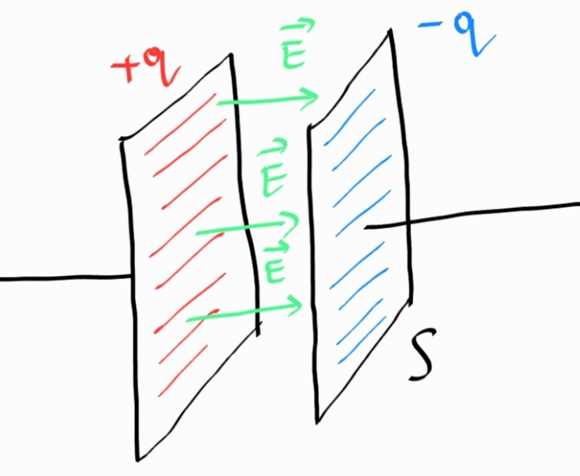

1. Кондензатор - система от две електропроводящи пластини, между които има диелектрик или вакуум
	
	
	
	**а) зареждане** - при свързване на кондензатора към източник на напрежение, върху двете му пластини ще се индуцират заряди с еднаква големина, но различен знак
	- електрично поле - между пластините на зареден кондензатор възниква еднородно електрично поле, което зависи от заряда на кондензатора $q$, диелектричната проницаемост $\varepsilon$ на средата между двете пластини и площта $S$ на пластините
	
	$$|\vec{E}| = \frac{q}{\varepsilon S}$$
	
	- напрежение - между пластините на кондензатора възниква напрежение, което зависи от разстоянието $d$ между тях
	
	$$U_C = d\cdot |\vec{E}|$$
	
	**б) разреждане** - ако източникът на напрежение се премахне, кондензаторът бързо ще се разреди, защото зарядите по пластините му се отблъскват, като по този начин ще протече ток по веригата

2. Капацитет ($C, [\text{F}]$) - отношението между заряда $q$ на кондензатора и напрежението $U_C$ между пластините му
	
	$$C \overset{\text{def}} = \frac{q}{U_C}$$
	
	**а) зависимост** - капацитетът е характеристична константа на кондензатора, която зависи само от площта на пластините $S$ и разстоянието $d$ между тях
	
	$$C = \varepsilon\frac{S}{d}$$
	
	**б) мерна единица** - фарад
	
	$$\left[\text{F} = \frac{\text{C}}{\text{V}}\right]$$

3. Потенциална енергия на кондензатор
	
	$$E_p = \frac{q^2}{2C} = \frac{qU}{2} = \frac{CU^2}{2}$$

5. Кондензатор в електрична верига - означава се с $-||-$
	
	**а) последователно свързване** - последователно свързаните кондензатори с капацитети $C_1, C_2, \cdots, C_n$ са еквивалентни на един кондензатор с капацитет $C_{\text{eq}}$, за който важи
	
	$$\frac{1}{C_{\text{eq}}} = \sum_{i=1}^n \frac{1}{C_i}$$
	
	**б) успоредно свързване** - последователно свързаните кондензатори с капацитети $C_1, C_2, \cdots, C_n$ са еквивалентни на един кондензатор с капацитет $C_{\text{eq}}$, за който важи
	
	$$C_{\text{eq}} = \sum_{i=1}^n C_i$$
	