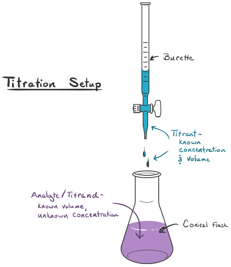

1. Моларност ($c, [\frac{\text{mol}}{\text{L}}]$) - молна концентрацията на разтвореното вещество в разтвора
	
	$$c(A) \coloneqq \frac{n(A)}{V_{\text{разтвор}}}, \left[ \frac{\text{mol}}{\text{L}} = \text{M}\right]$$
	
	**а) мерна единица** - моларност ($\text{M}$)
	- $1\text{ M} = 1 \frac{\text{mol}}{\text{L}}$

2. Молалност - молалната конентрация на разтвореното вещество в разтвора
	
	$$C_m(A) \coloneqq \frac{n(A)}{m_{\textbf{разтворител}}}, \left[\frac{\text{mol}}{\text{kg}} = \text{m}\right]$$
	
	**а) мерна единица** - молалност ($\text{m}$)
	- $1\text{ m} = 1\frac{\text{mol}}{\text{kg}}$
	
	**б) особености**
	- не зависи от температурата

3. Масова част на разтвореното вещество в разтвора
	
	$$w(A) \coloneqq \frac{m(A)}{m_{\text{разтвор}}}, w(A) \in [0;1]$$
	
	**а) единици**
	- проценти (%) - $w(A) \times 100\%$
	- parts per million (ppm) - $w(A) \times 10^6 \text{ ppm}$
	- parts per billion (ppb) - $w(A) \times 10^9 \text{ ppb}$

4. Закони за смесването и разреждането
	
	**а) закон за смесването** - при смесването на два разтвора с маси и масови части на разтвореното вещество съответно $m_1,w_1$ и $m_2,w_2$ се получава нов разтвор с маса $m_1+m_2$ и масова част $w_3$
	
	$$m_1w_1 +m_2w_2 = (m_1+m_2)w_3$$
	
	**б) закон за разреждането** - разреждането е просто смесваме с чист разтворител, т.е. с разтвор с нулева масова част на разтвореното вещество
	
	$$m_1w_1 = (m_1+m_2)w_3$$

5. Титруване - експериментален метод за определяне на концентрацията на компонентите в даден разтвор
	
	
	
	**а) процес**
	- в бюретата се сипва разтвор $A$ с известна молна концентрация
	- в Ерлен-Майеровата колба се сипва разтвор $B$ с неизвестна коненцентрация, но известен обем
	- в Ерлен-Майеровата колба се добавя и индикатор
	- чрез кранчето на бюретата започва бавно да се капе от разтвор $A$ в разтвор $B$ до пълно протичане на реакцията
	- когато индикаторът се измени напълно, реакцията е приключила и капенето се спира
	- отчита се промяната в обема $\Delta V_A$ на разтвора $A$ в бюретата, съставя се молно отношение по химичното уравнение на реакцията и се изчислява концентрацията на $B$