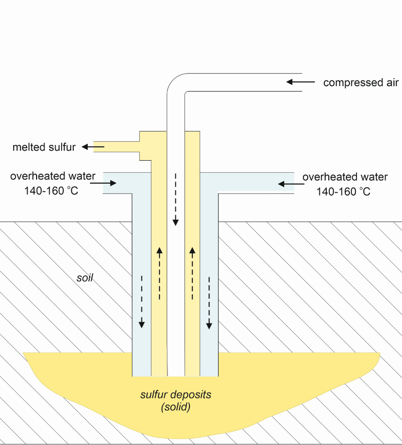

1. Атомни характеристики
	- III период, 16. (VIA) група
	- $\ce{[Ne] 3s^2 3p^4}$
	- малък атонен радиус
	- висока йонизационна енергия - може само да приема електрони
	- отрицателни йони
	- степени на окисление: -II, -IV, -VI

2. Полиморфни форми
	
	**а) ромбична сяра**
	- жълто, твърдо вещество
	- слаба миризма на кибрит
	- при нагряване до 115°С и последвало охлаждане се получава моноклинна сяра
	
	**б) моноклинна сяра**
	- стабилна от 96-113°С
	- прости ковалентни връзки между атомите
	
	**в) аморфна сяра**
	- рязко охлаждане на силно нагрявата сяра
	- тъмнокафяв цвят
	- като пластилин
	- много нестабилна

3. Физични свойства
	
	**а) физични характеристики**
	- висока температура на кипене $T_{\text{к}} = 446\degree \text{C}$
	- в газова фаза образува молекули от 2, 4 или 6 атома
	
	**б) разпространение**
	- като просто вещество - покрай вулканите
	- под формата на руди - пирит ($\ce{FeS2}$), сфалерит ($\ce{ZnS}$), галенит ($\ce{PbS}$), халкопирит ($\ce{CuFeS2}$), халкодит ($\ce{Cu2S}$)
	- под формата на сероводород - в нефта и природния газ
	
	**в) получаване**
	- метод на Фраш - добив на природна сяра
	
	

4. Химични свойства - предимни окислител
	
	**а) окислителни свойства**
	- с метали и водород
	
	$$\ce{H2 + S <=>[t°] H2S}$$
	
	$$\ce{2Na + S ->[t°] Na2S}$$
	$$\ce{Fe + S ->[t°] FeS}$$
	
	**б) редукционни свойства**
	
	$$\ce{S + O2->[t°] SO2}$$
	$$\ce{S + 3F2 -> SF6}$$
	$$\ce{S + 6HNO3 -> H2SO4 + 6NO2 + 2H2O}$$
	$$\ce{S + 2H2SO4 -> 3SO2 + 2H2O}$$

5. Сероводород ($\ce{H2S}$)
	
	**а) физични свойства**
	- газ
	- остра и неприятна миризма
	- минерални извори
	- отровен в големи количества
	
	**б) получаване**
	
	|Реагенти|Продукти|Реакция|
	|:--:|:--:|:--:|
	|неразтворим сулфид + разредена силна киселина||$\ce{FeS + 2H+ -> H2S + Fe^{2+}}$|
	
	**в) химични свойства** - много лесно се окислява
	
	|Реагенти|Продукти|Реакция|
	|:--:|:--:|:--:|
	|||$\ce{3H2S + H2SO4 -> 4S + 4H2O}$|
	|||метод на Клаус: $\ce{2H2S + SO2 ->[Al2O3, 250°C] S + H2O}$|
	|||$\ce{4Ag + 2H2S + O2 -> 2Ag2S + 2H2O}$|
	
	- в разтвор - образува слаба сероводородна киселина
	$$\ce{H2S + H2O <=> HS- + H3O+}$$
	
	$$\ce{HS- + H2O <=> S^{2-} + H3O+}$$
	- хидроген сол в нормална сол - чрез добавяне на основа

6. Серен диоксид ($\ce{SO2}$)
	
	**а) физични свойства**
	- вулканичен газ
	- остра и неприятна миризма
	
	**б) получаване**
	- промишлено - чрез пържене на руди или горене на сяра
	
	$$\ce{S + O2 ->[t°] SO2}$$
	$$\ce{2ZnS + 3O2 ->[t°] 2ZnO + 2SO2}$$
	
	$$\ce{Na2SO3 + 2HCl-> 2NaCl + H2SO3 \approx H2O + SO2}$$
	
	**в) химични свойства** - киселинни
	- и окислител, и редуктор
	
	|Взаимодействие|Продукти|Реакция|
	|:--:|:--:|:--:|
	|с основни оксиди|сулфит||
	|с основи|сулфит + $\ce{H2O}$|
	
	$$\ce{SO2_{(g)} + H2O_{(g)} <=> H2SO3}$$
	$$\ce{SO2 + Cl2 -> SO2Cl2 (сулфорил хлорид)}$$
	- с основи - силфит + H2O
	- с основни оксиди - сулфит
	
	**г) приложение**
	- дезинфекционни и избелващи свойства

7. Серен триоксид ($\ce{SO3}$)
	
	**а) физични свойства**
	- летлива течност
	- специфична миризма
	
	**б) получаване**
	- промишлено - контактно окисление на серен диоксид
	
	$$\ce{2SO2 + O2 <=>[450°C, cat] 2SO3_{(g)}}$$
	
	**в) химични свойства** - киселинни
	- само окислител
	$$\ce{SO3 + H2O -> H2SO4}$$
	- с основни оксиди - сулфати
	- с основи - сулфат + Х2О

8. Сериста киселина ($\ce{H2SO3}$)
	
	**а) физични свойства**
	- изключително нетрайна
	- съществува само във воден разтвор
	
	**б) химични свойства**
	- дисоциация
	
	$$\ce{I. H2SO3 + H2O -> HSO3- + H3O+}$$
	$$\ce{II. HSO3- + H2O -> SO3^{2-} + H3O+}$$
	
	- окисление
	
	$$\ce{2H2SO3 + O2 -> 2H2SO4}$$
	
	**в) соли**
	- хидроген солите са термично нестабилни
	
	$$\ce{2NaHSO3->[t°] Na2SO3 + SO2 + H2O}$$

9. Сярна киселина ($\ce{H2SO4}$)
	
	**а) физични свойства**
	- безцветна маслообразна течност - т.нар. концентрирана сярна киселина
	- дими на въздуха
	- нестабилно съединение
	
	**б) получаване**
	
	**в) химични свойства**
	- много силен окислител
	
	$$\ce{Cu + H2SO4 -> CuO + SO2 + H2O}$$
	$$\ce{CuO + H2SO4 -> CuSO4 + H2O}$$
	$$\ce{Cu + 2к.H2SO4 ->[t°] CuSO4 + SO2 + 2H2O}$$
	
	$$\ce{H2SO4 ->[t°] SO2 + H2O + O}$$
	
	- силно хигроскопична - извлича влагата
	- овъглява органични съединения
	- разреждане - киселината се добавя към водата
	- дисоциация
	
	$$\ce{H2SO4 + H2O -> HSO4- + H3O+}$$
	$$\ce{HSO4- + H2O -> SO4^{2-} + H3O+}$$
	
	**г) соли**
	- $\ce{Na2SO4}$ (глауберова сол) - медицина, производство на хартия
	- $\ce{CuSO4 . 5H2O}$ (син камък)
	- $\ce{FeSO4 . 7H2O}$ (зелен камък)
	- $\ce{ZnSO4 . 10H2O}$ (бял камък)
	
	**д) приложение**
	- производство на минерални торове
	- пречистване на нефт от вода
	- производство на лекарства и пластмаси
	- акумулатори
	- почистване на ръжда

	**е) производни на сярната киселина**
	- тиосулфати
	
	$$\ce{Na2SO3 + S ->[t°] Na2S2O3}$$
	
	- тиосярна киселина ($\ce{H2S2O3}$) - изключително нетрайна
	
	$$\ce{H2S2O3  -> H2SO3 + S}$$
	
	- пероксимоносярна киселина - много силна киселина
	- пероксидисярна киселина - много силни окислители