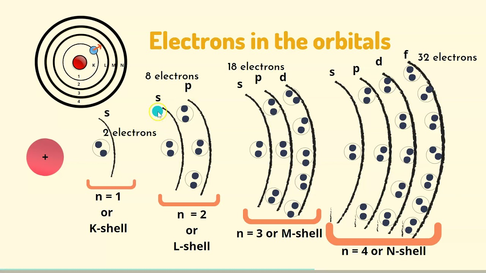
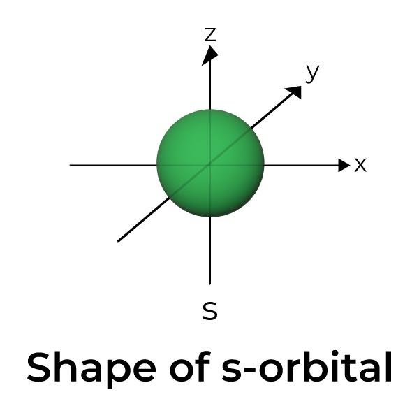
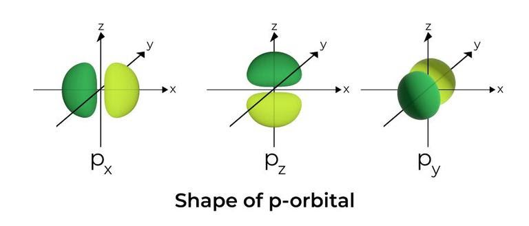
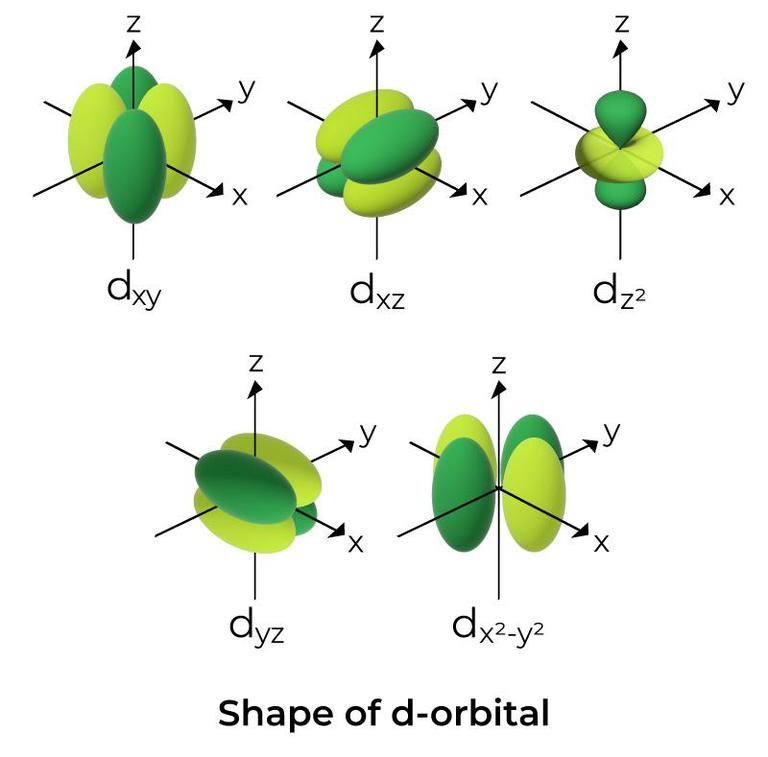
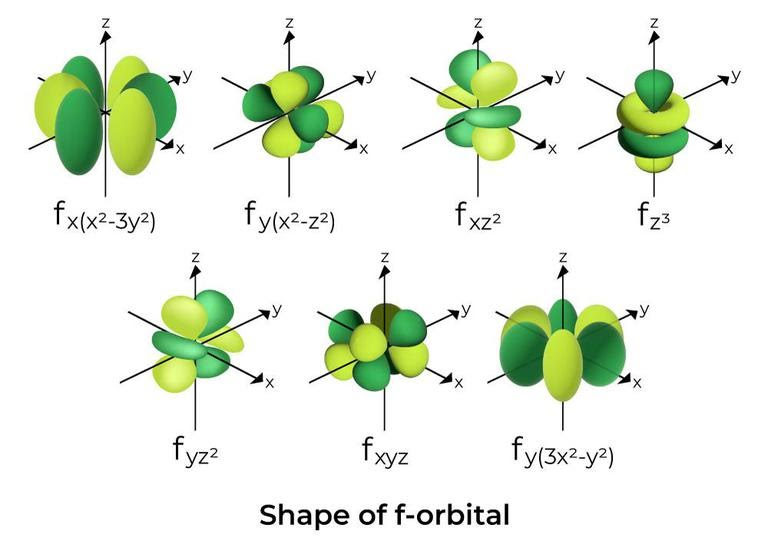

1. Квантови числа - всеки електрон в електронната обвивка може да са характеризира от четири числа
	
	**а) главно кватново число** ($n$) - показва електронния слой, в който се намира електронът
	
	
	
	- приема положителни целочислени стойности - $n = 1,2,...$
	- колкото по-високо е главното квантово число, толкова по-висока енергия имат електроните в съответстващия слой
	
	|$n$|Слой|
	|:--:|:--:|
	|$n=1$|K|
	|$n=2$|L|
	|$n=3$|M|
	|$n=4$|N|
	|$n=5$|O|
	|$n=6$|P|
	|$\vdots$|$\vdots$|
	
	**б) орбитално квантово число** ($l$) - показва подслоя, в който се намира електронът
	- всеки слой е разделен на подслоеве, всички от които имат близка до тази на слоя енергия
	- слой с главно квантово число $n$ се разделя на $n$ различни подслоя - първият слой се разделя на един подслой, вторият слой се разделя на два подслоя, третият на три и т.н.
	- орбиталното квантово писло показва номера на подслоя, започвайки от нулата - $l = 0,1,2,...,n-1$
	
	|подслой|означение|
	|:---:|:--:|
	|$l = 0$|s|
	|$l=1$|p|
	|$l=2$|d|
	|$l=3$|f|
	|$l=4$|g|
	|$\vdots$|$\vdots$|
	
	
	
	Пример:
	Електрон, който се намира в третият подслой ($l=2$) в слоя $N$ се означава с $\ce{4d}$, а електрон, който се намира във втория подслой на слоя $L$ ще се означи с $\ce{2p}$.
	
	**в) магнитно орбитално квантово число** ($m_L$) - характеризира взаимодействието на магнитното поле, създадено от движението на електрона при поставянето на атома във външно магнитно поле
	- $m_L \in \{-l,...,0,...l\}$
	
	**г) магнитно спиново квантово число** ($m_s$) - характеризира собствения магнитен момент на електрона
	- $m_s = \pm \frac{1}{2}$

2. Корпускулно-вълнови дуализъм - обектите в микросвета се описват от вълнови функции, което един път им придава свойства на частици, а друг път - на вълни
	
	**а) вълна на Дьо Бройл** - всеки обект се характеризира от вълна с дължина, зависеща от неговите маса и скорост 
	
	$$\lambda = \frac{h}{mv} = \frac{h}{p}$$
	
	**б) принцип на неопределеността на Хайзенберг** - не е възможно точното определяне на местоположението и скоростта на даден микрообект в един и същ момент
	
	$$\begin{cases}\Delta x\Delta p_x \ge \frac{\hbar}{2} \\ \Delta y\Delta p_y \ge \frac{\hbar}{2} \\ \Delta z\Delta p_z \ge \frac{\hbar}{2}\end{cases}$$
	- произведението в грешките между импулса и позицията винаги е по-голямо от $\frac{\hbar}{2}$
	- редуцирана константа на Планк: $\hbar \coloneqq \frac{h}{2\pi}$

3. Вълнова функция - всеки микрообект се описва от функция от вида $\Psi(x,y,z,t)$
	
	**а) уравнение на Шрьодингер** - описва еволюцията на вълновите функции
	
	$$-\frac{\hbar^2}{2m}\left(\frac{\partial^2\Psi}{\partial x^2}+\frac{\partial^2\Psi}{\partial y^2}+\frac{\partial^2\Psi}{\partial z^2}\right) + V(x,y,z)\Psi = i\hbar\frac{\partial \Psi}{\partial t}$$
	
	 - решенията на уравнението се наричат вълновни функции
	 - аналитични решения на уравнението съществуват само за прости системи като единични електрони
	 - в останалите случаи се използват числени методи за решаване
	 
	**б) статистическа интерпретация на Борн** - квадратът на абсолютната стойност на вълновата финкция $|\Psi(x,y,z,t)|^2$ дава вероятността обектът, който описва функцията, да се намира на мястото с координати $(x,y,z)$

4. Атомни орбитали - вълнови функции, които описват единични електрони в потенциала, създаден от атомното ядро
	
	**а) обозначение** - вълновата функция $\Psi_{n,l,m_L}$ описва електрон с квантови числа $n, l, m_L$
	- $n$ показва размера на орбиталата - колкото по-високо е $n$, толкова по-голяма енергия има електрона и толкова по-голяма е орбиталата
	- $l$ показва формата на орбиталата - орбитали с различно $n$ и еднакво $l$ имат еднаква форма, но различен размер
	- $m_L$ характеризира пространствената ориентация на обриталата
	
	**б) видове** - орбиталите с едно и също $l$ се групират заедно, показвайки подслоя, който описват
	- $s$-орбитала - описва електрон в $s$ подслой
	
	
	
	$$l=0;m_L=0$$
	
	- $p$-орбитали (3 вида) - описват електрони в $p$ подслой
	
	
	
	$$l=1;m_L=1,0,-1$$
	
	- $d$-обритали (5 вида) - описват електрони в $d$ подслой
	
	
	
	$$l=2;m_L = -2,-1,0,1,2$$
	
	- $f$-орбитали (7 вида) - описват електрони в $f$ подслой
	
	
	
	$$l=3; m_L = -3,-2,-1,0,1,2,3$$
	
	**в) квантова клетка** - всяка орбитала представлява квантова клетка, която може да съдържа най-много 2 електрона и то само ако спиновете им са противоположни
	
	**г) изродени орбитали** - орбитали с еднаква енергия (еднакви $n$ и $l$)
	- имат еднакъв размер и форма, но различна пространствена ориентация