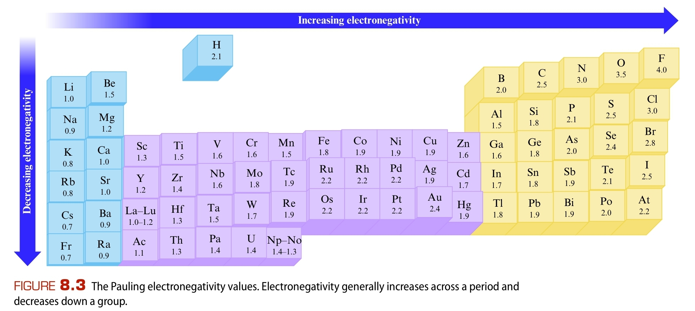

1. Ковалентна връзка - вид химична връзка, при която електрони се споделят между атомите и се образуват общи електронни двойки
	
	**а) обменен механизъм** - двата атома имат равностойно участие в образуването на електронната двойка
	
	**б) донорно-акцепторен механизъм** - единият атом вече има готова електронна двойка и позволява на другия да я използва

2. Порядък (кратност) - броят общи електронни двойки споделени между двата атома
	
	**а) прости връзки** - 1 споделена електронна двойка
	
	**б) сложни връзки** - 2 или 3 споделени електронни двойки

3. Полярност - разпределението на заряда по молекулата
	
	**а) електроотрицателност** ($\chi$) - свойството на даден атом да изтегля общата електронна двойка към себе си
	
	
	- надясно расте
	- надолу намалява
	- колкото по-висока е електроотрицателността на даден атом, толкова повече той изтегля към себе си споделената електронна двойка
	
	**б) видове връзки според полярността** - колкото по-голяма е разликата в електроотрицателностите на атомите във връзката, толкова по-полярна е тв
	- неполярни - електронната двойка е еднакво привлечена към двата атома, защото са от един и същ елемент
	- полярни - електронната двойка е изтеглена повече към един от атомите, при което се образуват частични заряди $\delta^-$ и $\delta^+$

4. Характеристики на ковалентните химични връзки
	
	**а) дължина** ($l, [\text{pm}]$) - разстоянието между ядрата на свързаните атоми
	- при хомоядрени молекули: $l = 2a_r(A)$
	- при хетероядрени молекули: $l = a_r(A) + a_r(B)$
	- обратнопропорционална на порядъка на връзката
	
	$$l \sim \frac{1}{\text{порядък}}$$
	
	**б) здравина** ($D, [\frac{\text{kJ}}{\text{mol}}]$) - енергията, нужна за разпадането на дадена ковалентна връзка в 1 мол вещество
	- обратно пропорционална на дължината на връзката - дългите връзки са по-чупливи
	
	$$D \sim \frac{1}{l}$$
	
	- правопропорционална на порядъка - повече споделени електронни двойки означават по-здрава връзла
	
	$$D \sim \text{порядък}$$
	
	- правопропорционална на полярността на връзката
	
	$$D \sim \text{полярност}$$

