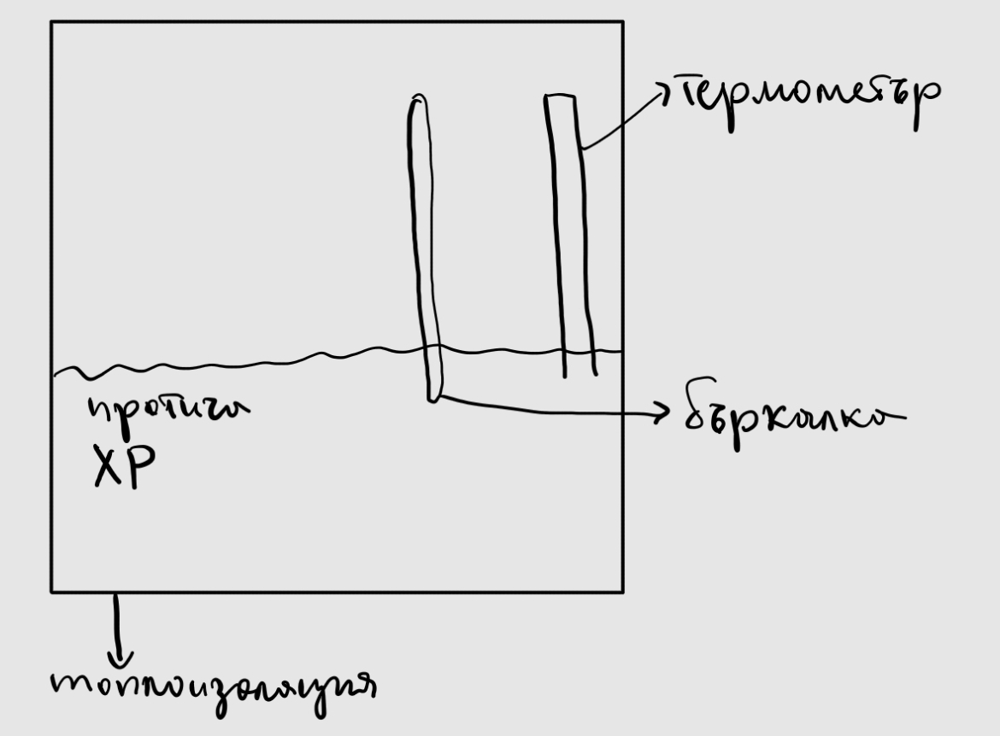

1. Калориметрия - експериментален метод за определяне топлинните ефекти на химичните реакции
	
	**а) калориметър** - изолирана система под постоянно налягане
	
	

2. Топлинен капацитет - количеството топлина, нужно за повишаването на температурата с 1° С
	
	**а) специфична топлоемкост** ($c_p, \left[\frac{\text{J}}{\text{kg}\cdot\text{K}}\right]$) - количеството топлина, нужно за повишаването на температурата на 1 килограм вещество с 1° К
	
	$$Q_p = c_pm\Delta T$$
	
	**б) молна топлоемкост** ($c_m, \left[\frac{\text{J}}{\text{mol}\cdot\text{K}}\right]$) - количествато топлина, нужно за повишаването на температурата на 1 мол вещество с 1° К
	$$Q_p = c_mn\Delta T$$