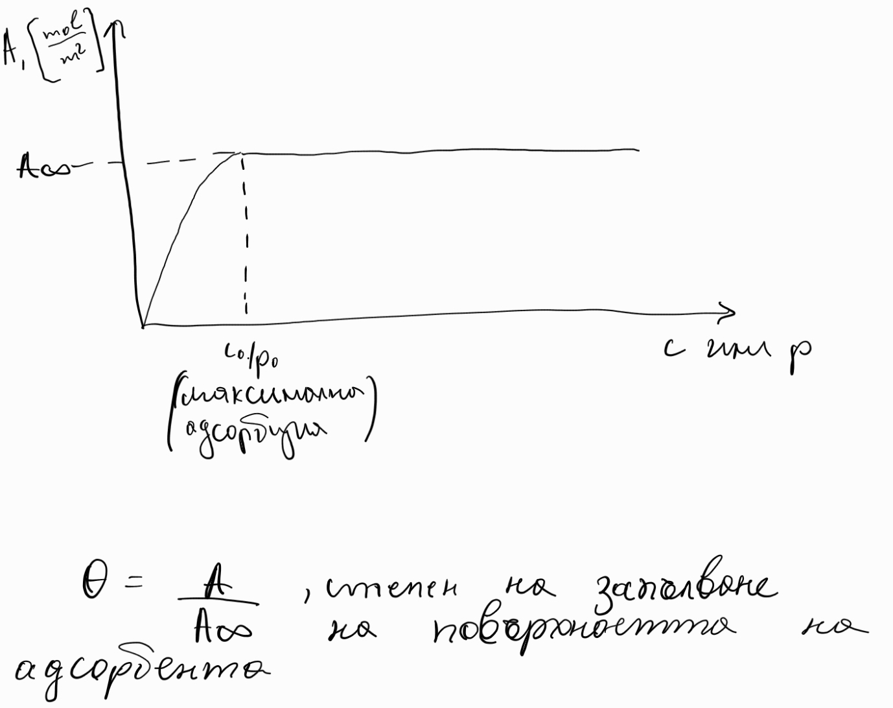

1. Абсорбция - процес на проникване на частиците от една фаза в обема на друга, преминавайки през фазовата граница
2. Адсорбция - процес, при който частиците на една фаза прилепват по базовата граница, без да преминават в другата фаза
	
	**а) физична адсорбция**
	- по-слаби междумолекулни
	взаимодействия
	- обратим процес
	
	**б) хемисорбция (химична адсорбция)**
	- протичане на реакция
	- необратими процес
	- често има и абсорбция
	
	**в) адсорбционна изотерма** графика, представяща адсорбцията като функция на концентрацията или парцалното налягане на адсорбата
	
	
