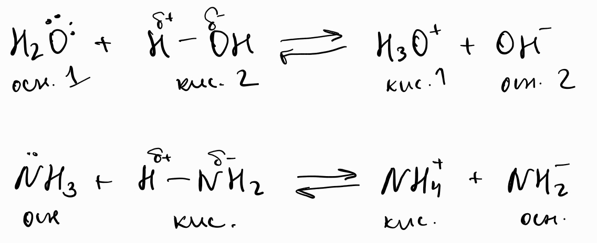

1. Автопротолиза - процес, при който едно вещество реагира само със себе си едновременно като киселина, и като основа
	
	
	
	**а) амфолит** - вещество, което може да бъде и основа, и киселина
	
	

2. Йонно произведение на водата ($K_w$) - дисоциационната константа на водата
	
	$$\ce{H2O_{(l)} + H2O_{(l)} <<=> H3O+ + OH-}$$
	
	$$K_w = \ce{[H3O+][OH-]}$$
	
	*За разредени разтвори,* $K_w$ *не зависи от количеството на разтвореното вещество.*
	
	**а) йонно произведение на водата при стандартни условия** ($T = 25\degree \text{C}$)
	
	$$K_w = 1.0\times 10^{-14}$$
	$$\ce{[H3O+] = 1.0\times 10^{-7} \frac{\text{mol}}{\text{L}}= [OH-]}$$
	
	**б) сила на протолитни двойки**
	
	$$K_a \times K_b = K_w \implies pK_a + pK_b = pK_w \implies pK_a + pK_b = 14\, (T = 25\degree \text{C})$$
	
	Доказателство:
	
	$$\ce{HA/A-}$$
	
	$$\ce{HA_{(aq)} + H2O_{(l)} <=> A-_{(aq)} + H3O+_{(aq)}}, K_a = \frac{\ce{[A-][H3O+]}}{\ce{[HA]}}$$
	
	$$\ce{A-_{(aq)} + H2O_{(l)} <=> HA_{(aq)} + OH-_{(aq)}}, K_b = \frac{\ce{[HA][OH-]}}{\ce{[A-]}}$$
	

3. Водороден показател ($\text{pH}, []$)
	
	$$\text{pH} \overset{\text{def}}{=} -\lg \ce{[H3O+]}$$
	
	*Значещите цифри на* $\text{pH}$ *са колкото са значещите цифри в концентрацията на хидроксониевите йони.*
	
	**а) киселинност на водните разтвори**
	
	
	
	||Киселинни|Неутрални|Основни|
	|:---:|:---:|:---:|:---:|
	|$\text{pH}$|$\lt 7$|$\approx 7$|$\gt 7$|
	|$\ce{[H3O+]}$|$\gt 1.0\times 10^{-7}$|$\approx 1.0\times 10^{-7}$|$\lt 1.0\times 10^{-7}$|
	|$\ce{[OH-]}$|$\lt 1.0\times 10^{-7}$|$\approx 1.0\times 10^{-7}$|$\gt 1.0\times 10^{-7}$|
	
	**б) определяне на** $\text{pH}$
	- чрез индикатор - слаба киселина, която има различно оцветяване в киселинна и основна среда
	
	|Индикатор|Област на валидност|
	|:--:|:--:|
	|фенолфталейн|малиненочервен: $\text{pH}\in [8;10]$   иначе безцветен|
	
	 - чрез $\text{pH}$-метър
	
	**в) функцията** $p$ - отрицателен десетичен логаритъм на дадена величина
	
	$$p(\text{величина}) \overset{\text{def}}{=} - \lg \text{величина}$$
	
	- $\text{pH} + \text{pOH} = 14$