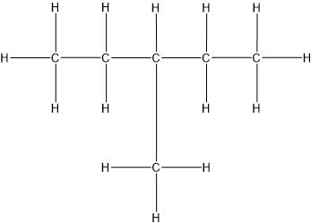
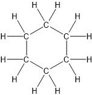

1. Химия на органичните съединения
	
	**а) органична химия** - дял от химията, изучаващ съединенията на въглерода без неговите оксиди, въглеродната киселина и солите ѝ
	
	**б) видове вещества**
	- в Средновековието - минерални, растителни и животински
	- XVIIв. - неорганични, минерални и органични

2. Защо въглеродът образува толкова много съединения
	
	**а) валентност** - въглеродът в тези съединения е винаги четиривалентен
	
	**б) образуване на въглеродни вериги** чрез свързване с други въглеродни атоми
	
	**в) видове връзки между въглеродните атоми** - могат да се свързват както с прости (единични) връзки, така и със сложни (двойни или тройни)
	
	**г) сила на връзките** - въглеродът образува здрави връзки не само с други въглеродни атоми, но и с хетероатоми (атоми на други елементи)

3. Видове въглеродни вериги
	
	**а) ациклични** (отворени)
	- прави
	
	- разклонени
	
	
	**б) циклични** (затворени)
	

4. Видове въглеродни атоми във веригите - определя се от броя на пряко свързаните с даден въглероден атом други такива
	
	**а) първични** ($1^0$)
	
	**б) вторични** ($2^0$)
	
	**в) третични** ($3^0$)
	
	**г) четвъртични** ($4^0$)