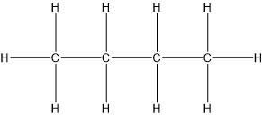

1. Основни предпоставки
	
	**а) учение за валентността**
	
	**б) образуване на въглеродни вериги**
	
	**в) учения за атомно-молекулната теория**

2. Основни положения и класическата структурна теория - атомите в молекулата си влияят по строго определен начни според валентността
	
	**а) изомерия** - вещества с еднакъв качествен и количествен състав, но с различни строеж и свойства

3. Видове структурни формули
	
	**а) молекулни** - $\ce{C4H10}$
	
	**б) пълна**
	
	
	
	**в) съкратена** - $\ce{CH3\bond{-}CH2\bond{-}CH2\bond{-}CH3}$
	
	**г) скелетна**