# Въглеводори
1. Въглеводори - съдържат само въглеродни и водородни атоми; всички останали органични съединения са техни производни

2. Видове
	
	**а) според вида на въглеродните вериги**
	- ациклични
	- циклични
	
	**б) според вида на химичните връзки**
	- наситени - съдържат само прости (единични) връзки
	- ненаситени - съдържат поне една сложна (двойна или тройна) връзка
	- ароматни - циклични въглеводороди с поне едно ароматно ядро

## Алкани. Наситени въглеводори
1. Алкани - клас ациклични въглеводородни съединения, съдържащи само прости връзки
	
	**а) обща формула** - $\ce{C_nH_{2n+2}}$
	
	**б) хомолжен  ред** - ред от сходни по строеж и свойства органични съединения, чиито молекули се различават само по броя на метиленовите групи ( $\ce{\bond{-}CH2\bond{-}}$ )
	
	|Наименование|Молекулна формула|Рационална формула|Състояние при 25°С|$T_k , [\degree C]$|
	|---------------|-----------------|---------------|----------------|---------------|
	|метан|$\ce{CH4}$|$\ce{CH4}$|газ|-162|
	|етан|$\ce{C2H6}$|$\ce{CH3CH3}$|газ|-89|
	|пропан|$\ce{C3H8}$|$\ce{CH3CH2CH3}$|газ|-42|
	|бутан|$\ce{C4H10}$|$\ce{CH3CH2CH2CH3}$|газ|0|
	|пентан|$\ce{C5H12}$|$\ce{CH3CH2CH2CH2CH2CH3}$|течност|36|
	|хексан|$\ce{C6H14}$|$\ce{CH3CH2CH2CH2CH2CH2CH3}$|течност|69|
	||||||
	|алкан|$\ce{C_nH_{2n+2}}$||Плавно изменяне с увеличаване на молекулната маса.|Плавно изменяне с увеличаване на молекулната маса.|
	
	**в) изомерия** - множество от органични съединения с еднаква молекулна формула, но различна структура
	- верижна - съединенията се различават по реда на свързване на въглеродните атоми
	
	**г) наименование**
	- на хомоложния ред - с изключение на първите 4 (метан, етан, пропан, бутан) името се образува от броя на въглеродните атоми на латински или гръцки + наставка "-ан"
	- на алкани с права верига - "n-" + наименованието от хомоложния ред: $\ce{CH3\bond{-}CH2\bond{-}CH2\bond{-}CH3}$ (n-бутан)
	- на алкани с разклонена верига - алкилови групи ( $\ce{C_nH_{2n+2} -> C_nH_{2n+1}}$ ); имената са същите като при хомоложния ред, но с наставка "-ил"
	
	|Правило|Пример|
	|--------|---------|
	|1. Определя се веригата с най-много въглеродни атоми. Разклоненията на тази верига са алкилови групи, наречени *заместители*.|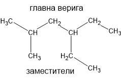|
	|2. Определят се позицията на заместителите (от ляво надясно) и техните наименования.|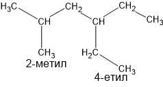|
	|3. Наименованията на заместителите се подреждат по азбучен ред и се записват пред наименованието на алкана от хомоложния ред, отговарящ на броя въглеродни атоми в главната верига.|4-етил-2-метилхексан|
	|4. При повече от едно разклонение на една и съща позиция, позицията се записва два пъти. Ако заместителите са едни и същи, пред наименованието на алкиловата група се записва представка (ди-, три-, тетра-,...), като тя не се отчита при подреждането по азбучен ред.|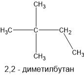|
	
2. Физични свойства
	- газове - $\ce{C1 - C4}$, без мирис
	- течности - $\ce{C5 - C15}$, бензинова миризма
	- твърди - $\ce{C16+}$, без мирис
	- неразтворими във вода
	- повишаване на температура на топене и кипене с увеличаване на молекулната маса

3. Химични свойства - слабореактивни
	
	**а) горене** - до въглероден диоксид и вода; отделя се голямо количество топлина
	$$\ce{C_{n}H_{2n+2} + $\frac{(3n + 1)}{2}$ O2 -> $n$CO2 + (n + 1)H2O}$$
	$$\ce{C3H8 + 5O2 -> 3CO2 + 4H2O}$$
	
	**б) заместване** (халогениране) - атом или атомна група от едно вещество се замества с такова от друго
	
	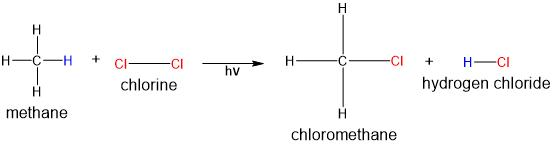
	
	$$\ce{CH4 ->[Cl2, hv][-HCl] CH3Cl ->[Cl2, hv][-HCl] CH2Cl2 ->[Cl2, hv][-HCl] CHCl3 ->[Cl2, hv][-HCl] CCl4}$$
	
	**в) синтез на Вюрц** - получаване на алкани с по-дълга верига от монохалогенопроизводни на алканите чрез натрий
	
	$$\ce{CH3\bond{-}Cl + 2Na + Cl\bond{-}CH3 -> CH3\bond{-}CH3 + 2NaCl}$$

### Метан ( $\ce{CH4}$ )
1. Разпространение
	
	**а) в горивата**
	- разтворен се съдържа в нефта
	- основен компонент на природния газ
	
	**б) газ гризу** - взривоопасна смес на метан и въздух, която се образува във въглищните мини
	
	**в) блатен газ** - образува се при гниене на органични вещества в отсъствие на кислород
	
	**г) в атмосферата** - парников газ
	
	**д) в животинските организми**

2. Строеж - един въглероден атом и четири водородни атома, свързани с прости, равностойни, слабополярни и много силни връзки, които са разположени под ъгъл 109°28' във върховете на правилен тетраедър
	
	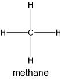
	
	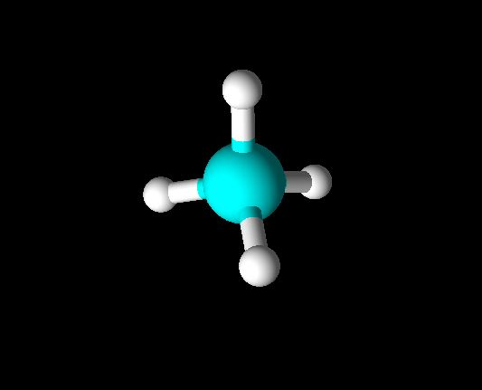

3. Физични свойства - безцветен газ, без мирис, по-лек от въздуха, слаборазтворим във вода; трудно втечняване, при ниска температура и високо налягане

4. Химични свойства - малка реактивоспособност
	
	**а) горене** - отделя се голямо количество топлина
	
	$$\ce{CH4 + 2O2 -> CO2 + 2H2O} + Q$$
	
	**б) халогениране** - заместителни реакции с халогени
	
	
	
	$$\ce{CH4 ->[Cl2, hv][-HCl] CH3Cl ->[Cl2, hv][-HCl] CH2Cl2 ->[Cl2, hv][-HCl] CHCl3 ->[Cl2, hv][-HCl] CCl4}$$
	
	**в) термично разлагане** 
	
	$$\ce{CH4 ->[t\degree] C + 2H2}$$

5. Получаване - главно от природния газ
	
	**а) в промишлеността** - синтез от водна смес
	
	$$\ce{CO + 3H2 <=>[t\degree, Ni] CH4 + H2O}$$
	
	**б) лабораторно** - от алуминиев карбид
	$$\ce{Al4C3 + 12H2O ->[t\degree] 4Al(OH)3 v + 3CH4 ^}$$

6. Употреба - висококачествено гориво; суровина за производството на органични съединения
	
	**а) термично разлагане** - образува сажди, намиращи приложение в каучуковата промишленост
	
	**б) халогенопроизводните на метана** - ценни разтворители

## Алкени. Ненаситени въглеводороди
1. Строеж - имат една сложна (двойна) връзка между два въглеродни атома. Връзките, изграждаща сложната, не са равностойни - едната е много по-слаба и е причина за високата реактивоспособност на този клас съединения
	
	**а) обща формула** - $\ce{C_nH_{2n}}$

2. Хомоложен ред
	
	|Наименование|Молекулна формула|
	|:----------------:|:----------------:|
	|етен|$\ce{C2H4}$|
	|пропен|$\ce{C3H6}$|
	|бутен|$\ce{C4H8}$|
	|пентен|$\ce{C5H10}$|
	|хексен|$\ce{C6H12}$|
	|||
	|алкен|$\ce{C_nH_{2n}}$|
	
	**а) наименование** - по същия начин като при алканите, но "-ан" се замества с "-ен", а за главна верига се приема тази, която съдържа двойната връзка. Алкиловите групи се номерират от този край на веригата, който е по-близо до двойната връзка.
	
	**б) изомерия** - при алкените с повече от три въглеродни атома е възможна и *позиционна* изомерия, при която двойната връзка се намира на различна позиция. Тогава позицията на тази връзка се записва между основата на наименованието от хомоложния ред и наставката "-ен".
	
	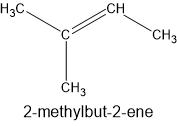

3. Физични свойства - същите като на алканите

4. Химични свойства - висока реактивоспособност
	
	**а) присъединителни реакции** - реакции, при които към молекула със сложна връзка се присъединява друга молекула и се получава един продукт
	- хидриране - присъединяване на водород; получават се алкани
	
	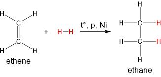
	- халогениране - присъединяване на халогени
	
	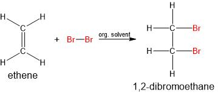
	- присъединяване на полярни молекули към асиметричен водород - Правило на Марковников: водородният атом от полярната молекула се присъединява към този въглероден атом от сложната връзка, който е по-богат на водородни атоми
	
	
	- присъединяване на вода - получават се алкохоли
	
	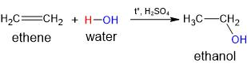
	
	**б) горене** - отделя се голямо количество топлина
	
	$$\ce{C_nH_{2n} + $\frac{3n}{2}$O2 -> nCO2 + nH2O}$$
	
	**в) полимеризация** - образуване на макромолекули (полимери) чрез разрушаване на сложните връзки в мономерите при определни условия
	
	$$\ce{nH2C\bond{=}CH2 -> (\bond{-}CH2\bond{-}CH2\bond{-})_n}$$
	
	**г) доказване на сложната връзка** - обезцветяването на бромна вода и разтвор на калиев перманганат са качествена реакция за доказването на наличието на сложна връзка в състава на органично съединение

5. Получаване
	
	**а) чрез извличане от нефт**
	
	**б) промишлено** - чрез дехидратация на алкан със същия брой въглеродни атоми
	
	$$\ce{CH3\bond{-}CH2\bond{-}CH3 ->[t\degree,p][Ni] CH3\bond{=}CH2\bond{-}CH3 +H2 ^}$$
	
	**в) лабораторно** - чрез дехидратация на алкохоли
	
	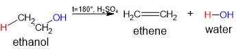
	
	**в) от монохалогенопроизводни на алканите** с алкохолен разтвор на $\ce{KOH}$
	
	

## Алкини
1. Строеж - имат една сложна (тройна) връзка, като две от връзките, които я съставляват, са по-слаби и лесно се разкъсват при химични реакции

2. Хомоложен ред
	
	|Наименование|Молекулна формула|
	|:----------------:|:----------------:|
	|етин|$\ce{C2H2}$|
	|пропин|$\ce{C3H4}$|
	|бутин|$\ce{C4H6}$|
	|пентин|$\ce{C5H8}$|
	|хексин|$\ce{C6H10}$|
	|||
	|алкин|$\ce{C_nH_{2n-2}}$|
	
	**а) наименование** - по същия начин както при алкените, но с наставка "-ин"

3. Физични свойства - същите като на алканите и алкените

4. Химични свойства
	
	**а) присъединителни реакции** - подобни на алкените
	
	$$\ce{HC\bond{#}CH + H2 ->[t\degree, p, Ni] H2C\bond{=}CH2 + H2 ->[t\degree, p, Ni] CH3\bond{-}CH3}$$
	- реакция на Кучеров - присъединяване на $\ce{H2O}$: получават се алдехиди или кетони, като реакцията протича в киселинна среда, при нагряване и в присъствието на живачни соли
	
	
	
	**б) горене** - горят с отделяне на голямо количество топлина
	
	$$\ce{C_nH_{2n-2} + $\frac{3n-1}{2}$O2 -> nCO2 + nH2O}$$

5. Получаване - главно от нефта
	
	**а) промишлено** - пиролиза на метан
	
	$$\ce{2CH4 ->[t=2000\degree C] C2H2 + 3H2}$$
	
	**б) лабораторно**
	$$\ce{CaC2 + 2H2O -> Ca(OH)2 + C2H2}$$

6. Употреба - ацетиленът (етинът) се използва в ацетиленовите горелки, за полочаване на поливинилхлорид (PVC), синтетични влакна, каучук и др.

## Арени
1. Строеж - циклични въглеводороди, които имат ароматно (бензеново) ядро; $\ce{C_nH_{2n-6}}, n \ge 6$
	
	**а) ароматно ядро** - цикъл от 6 въглеродни атома, свързани помежду си чрез *делокализирана* връзка
	- делокализирана връзка - особен вид химична връзка, която е много стабилна и трудно разрушима
	- начини за изобразяване в структурни формули
	
	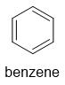

### Бензен
1. Състав и строеж - най-простият арен, $\ce{C6H6}$

2. Физични свойства - безцветна, лесно подвиждна течност със специфична бензинова миризма; малко разтворим във вода, но добре разтворим в органични разтворители; много добър разтворител на йод, фосфор и др.; отровно и канцерогенно вещество
	
	**а) температура на кипене и топене** - 80,1°С и 5,5°С

3. Химични свойства
	
	**а) заместителни реакции** - халогениране, нитриране и сулфониране
	- халогениране
	
	
	
	- нитриране
	
	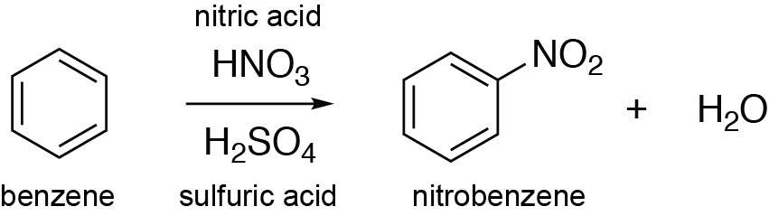
	
	**б) присъединителни реакции** - протичат трудно
	
	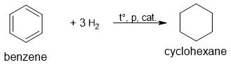
	
	**в) горене** - изгаря със силно пушлив пламък
	
	$$\ce{2C6H6 + 15O2 -> 12CO2 + 6H2O}$$

4. Получаване - главно от нефта
	
	**а) промишлено** - от етин при определени условия
	
	$$\ce{3C2H2 ->[t\degree, p, cat] C6H6}$$

5. Употреба - за получаване на пластмаси, лекарства и др; често се включва в състава на горивата, за да ги подобри