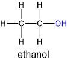
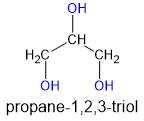

# Хидроксилни производни
1. Същност - производни на въглеводородите, при които един или повече водородни атома са заместени с хидроксилни групи ( $\ce{\bond{-}OH}$ )

2. Видове
	
	**а) алкохоли** (алканоли) - производни на наситените въглеводороди
	
	**б) феноли** - производни на ароматните въглеводороди, чиито хидроксилни групи са директно свързани с бензеновото ядро

3. Валентност - броят на хидроксилните групи в състава на производното

## Наситени едновалентни алкохоли
1. Строеж - $\ce{C_nH_{2n+1}OH}$
	- силно полярна връзка във функционалната група $\ce{\bond{-}OH}$

2. Наименование - по същия начин както при алканите, но с добавянето на окончанието "-ол"
	
	|Наименование|Молекулна формула|Състояние при 25°С|$T_k , [\degree C]$|
	|---------------|-----------------|---------------|----------------|
	|метанол|$\ce{CH3OH}$|течност|65|
	|етанол|$\ce{C2H5OH}$|течност|78|
	||||
	|алканол|$\ce{C_nH_{2n+1}OH}$|||

### Етанол
1. Състав и строеж - $\ce{C2H5OH}$
	
	

2. Физични свойства - безцветна, лесноподвижна летлива течност със специфична миризма и парлив вкус; по-лек от водата и се разтваря неограничено в нея; отличен разтворител

3. Химични свойства - неутрален
	
	**а) взаимодействие с алкални метали** - получават се етилат и водород
	
	$$\ce{2CH3CH2OH + 2Na -> \underset{\text{натриев етилат}}{2CH3CH2ONa} + H2 ^}$$
	
	**б) естерификация** - взаимодействие с киселини при нагряване; някои от получените естери имат приятна миризма
	
	$$\ce{CH3CH2OH + HONO2 <=>[H^+, t\degree] \underset{\text{етилов естер на азотната киселина}}{CH3CH2ONO2} + H2O}$$
	
	**в) дехидратация** - използва се за лабораторно получаване на етен
	
	$$\ce{CH3CH2OH <=>[H2SO4, t\degree] CH2\bond{=}CH2 + H2O}$$
	
	**г) горене** - бледосин пламък, отделящ голямо количество топлина
	
	$$\ce{CH3CH2OH + 3O2 -> 2CO2 + 3H2O}$$

4. Получаване - чрез спиртна ферментация на глюкоза; чрез хидратация на етен

5. Употреба - лекарства, лакове, одеколони и есенции

## Многовалентни алкохоли
1. Същност - многовалентните алкохоли (полиоли) са алкохоли, съдържащи повече от една хидроксилни групи в състава си
2. Наименование - след името на алкана, от който произлизат, се посочват позициите и  броят на $\ce{\bond{-}OH}$ групите, като пред окончанието "-ол" се добавя представка от вида на "ди-", "три-", "тетра-", и т.н.

### Етиленгликол
1. Структура и строеж - етан-1,2-диол ( $\ce{C2H4(OH)2}$ )

2. Физични свойства - безцветна, сладка и силно отровна течност

3. Употреба - в антифризите

### Глицерол (Глицерин)
1. Състав и строеж - пропан-1,2,3-триол ( $\ce{C3H5(OH)3}$ )

	

2. Физични свойства - безцветна, сироповидна течност без миризма, но със сладък вкус; по-тежък от водата и много добре разтворим в нея; силно хигроскопичен

3. Химични свойства 
	
	**а) взаимодействие с алкални метали** - получават се глицерати и водород
	
	$$\ce{2C3H5(OH)3 + 6Na -> \underset{\text{тринатриев глицерат}}{2C3H5(ONa)3} + 3H2 ^}$$
	
	**б) доказване на повече от една съседни хидроксилни групи** - при взаимодействие с $\ce{Cu(OH)2}$ се получава се получава разтворимо съединение с тъмносин цвят
	
	**в) естерификация** - с кислородосъдържащи киселини
	
	
	
	**г) горене** -  с безцветен пламък

4. Получаване - от отпадните газове при преработка на нефт, съдържащи пропен; от природни мазнини;

5. Употреба - хранително-вкусовата промишленост, козметиката, в сапуните и пастите за зъби, обувки, лепила и др.

## Феноли
1. Същност - съединения, които имат хидроксилни групи, директно свързани с бензенов пръстен, в състава си

2. Ароматни алкохоли - съединения, чиито хидроксилни групи са свързани към бензенов пръстен чрез алкилов остатък

### Фенол
1. Състав и строеж - бензеново ядро, директно свързано с една хидроксилна група ( $\ce{C6H5OH}$ ); най-простият представител на фенолите
	
	

2. Физични свойства - безцветно кристално вещество със специфична миризма; топи се при 43°С и кипи при 182°С; при контакт с въздуха се окислява и постепенно променя цвета си в розов до червено-кафяв; малко разтворим в студена вода, но се разтваря напълно в гореща

3. Химични свойства - слабо киселинни, защото полярността на връзката в $\ce{\bond{-}OH}$ групата се засилва под влияние на бензеновото ядро; не реагира с карбонати
	
	**а) дисоциация** - разтворът му е известен като карболова киселина
	
	$$\ce{C6H5OH <=> H^+ + \underset{\text{фенолатен анион}}{C6H5O^-}}$$
	
	**б) взаимодействие с натрий**
	
	$$\ce{2C6H5OH + 2Na -> \underset{\text{натриев фенолат}}{2C6H5ONa} + H2 ^}$$
	
	**в) взаимодействие с натриева основа**
	
	$$\ce{C6H5OH + NaOH <=> C6H5ONa + H2O ^}$$
	
	**г) взаимодействие с цинк**
	
	$$\ce{C6H5OH + Zn -> C6H6 + ZnO}$$
	
	**д) заместителни реакции** - заместват се водородни атоми на 2., 4. и 6. позиция спрямо хидроксилната група
	
	
	
	- нитриране - получава се пикринова киселина, която се използва за оцветяване на вълна и коприна в жълто и като взривно вещество
	
	
	
	**е) окисление** - окислява се от въздуха; отнема кислорода от водата и затова е замърсител
	
	**ж) горене** - с пушлив пламък
	
	**з) качествена реакция за доказване на фенол** - при взаимодействие с $\ce{FeCl3_{(aq)}}$ образува съединение с лилав цвят

4. Получаване - от каменовъгления катран при преработка на въглища; чрез хлоробензен и натриева основа под високо налягане и температура

5. Употреба - отрова; производство на найлони, пластмаси; антисептици и дезинфектанти; багрила, лекарства, взривни вещества