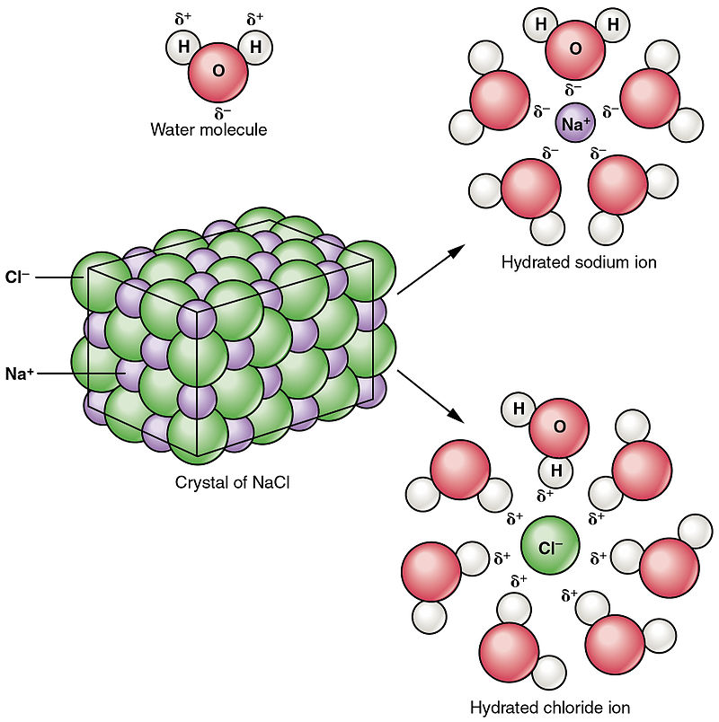

1. Обща характеристика - стабилни хомогенни смеси, състоящи се от два или повече компонента
	
	**а) разтворител** - веществото с най-голямо количество
	- определя агрегатното състояние на разтвора

2. Видове разтворители
	
	**а) според състава**
	- неорганични - вода, амоняк, сярна киселина
	- органични - спирт, ацетон, хексан, бензен, хлороформ
	
	**б) според полярността на молекулата**
	- [ ] полярни - разтварят други полярни или йонни вещества
		- вода ($\ce{H2O}$), етанол ($\ce{C_2H_5OH}$), сярна киселина ($\ce{H_2SO_4}$)
	- [ ] неполярни - разтварят други неполярни вещества
		- хексан ($\ce{C6H14}$), бензен ($\ce{C6H6}$), тетрахлорометан ($\ce{CCl4}$)

3. Същност на разтварянето - спонтанен физикохимичен процес, който протича при контакт на разтворителя д разтварящото се вещество
	
	**а) разпад на връзките между частиците на разтварящото се вещество** - топлинен ефект $Q_1$
	
	**б) солватация** - процес на образуване на солвати (групировки на частиците на разтворителя около частиците на разтварящото се вещество)
	- хидратация и хидрати при разтворител $\ce{H2O}$
	- топлинен ефект - $Q_2$
	
	
	
	**в) топлинен ефект на разтварянето** - $Q = Q_1 + Q_2$
	- ендо- или екзотермичен процес
	
	**г) кристализация** - обратният на разтварянето процес

4. Видове разтвори
	
	**а) при дадена температура**
	- наситен - равновесно състояние между разтварянето и кристализацията, при което концентрацията на разтвореното вещесто е постоянна
	- ненаситен разтвор - концентрацията на разтвореното вещество е по-ниска от тази в наситения разтвор - равновесие не е достигнато все още
	- преситен разтвор - нестабилен разтвор с по-висока от равновесната концентрация на разтвореното вещество, която може да се постигне при определени условия; лесно кристализира
	
	**б) според вида на частиците на разтвореното вещество**
	- молекулни
	- йонни
	- молекулно-йонни
	
	**в) според количеството вещество**
	- концентрирани
	- разредени